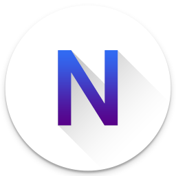

  

# [Material Design New Tab](https://tab.xiejie.co)

A new tab page extension for Chrome which uses Material Design.

## [Install from the Chrome Web Store](https://chrome.google.com/webstore/detail/material-design-new-tab/kgfodmcknjlgkbgkkafogbdaibkfgdgo)

## Features
- Manage your favorite websites
- Switchable search engine
- Weather information
- Chrome apps and bookmarks
- Customizable settings

## Browser Support
- Chrome 50+

## Feedback
Please create an issue if you have any questions or suggestions about it.

## Donation
If you find the extension useful, you can buy me a cup of coffee.  
The `DONATE` button at settings page.💖

## License
[MIT](LICENSE)  
Copyright (c) 2016-present ConanXie
