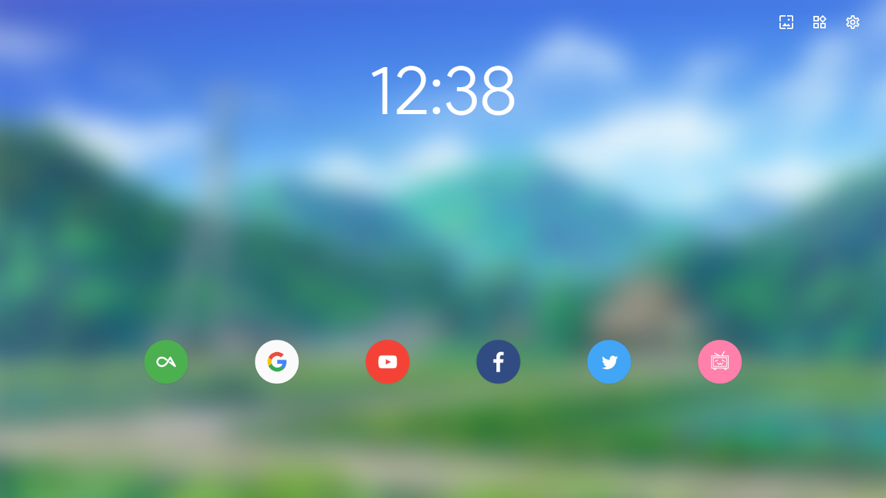

  

# Material Design New Tab

A Chrome new tab page extension with **Material Design**.

## Features
- Shortcuts management
- Personalized background
- Magical widgets (TODO)

## Feedback
Please create an issue if you have any questions or suggestions about it.

## Thanks
Special thanks to those who make this extension support more languages.
- **Russian** @Руслан Чешневский
- **Bulgarian** @Martin Minchev

## License
[MIT](LICENSE)  
Copyright (c) 2016-present ConanXie
